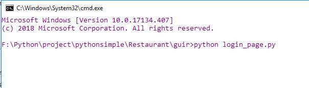

# Restaurant Invoice System
In this project my aim to create a restaurant invoice system whose provide by the restaurant to the customer.
## Technology & Concept:
    In this I am using the Tkinter library for the designing all windows. Mysql is used for database storing the username and password. File handling used for saving the invoice soft copy in text form. You can see on the directory customer in the project and regular expressions are used for creating the total of the all items in the invoice. 
## System Requirements:
    • Python 3.7 download from https://www.python.org/downloads/
    • Tkinter library for GUI download steps:
        ◦ Open cmd
        ◦ Write command pip install tkinter
    • Mysql : If need in your system you can be download and install on link https://www.mysql.com/downloads/
        ◦ Write command in cmd  pip install pymysql for link between mysql and python.
## How to run:
    1. Open cmd on location where you are save/download project and write the command python login_page.py ->press enter like:
     
    2. After some time the following window is appear:
       
    3. Enter user root and password is root which you are enter unter the db restaurant and  in the mysql table like login:
        1.Firstly you are create a database in mysql name restaurant and create a table under the restaurant database name login. 
            
            
        2.Enter the user whose want to login in yours software like following users:
            
    4.Login by the given mysql login table users:
        
    5. After login the add the customer details like customer number, name, address, mobile number ,allocated table(like following):
        
    6. Select the items under the course whose want to customer :
        
    7. After selection the dishes click on the final button and the click on the bill button:
        
